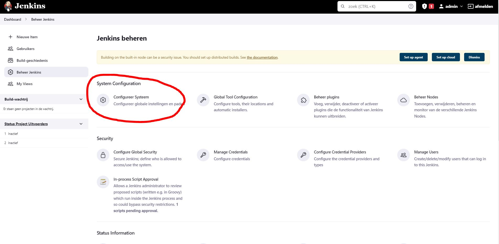
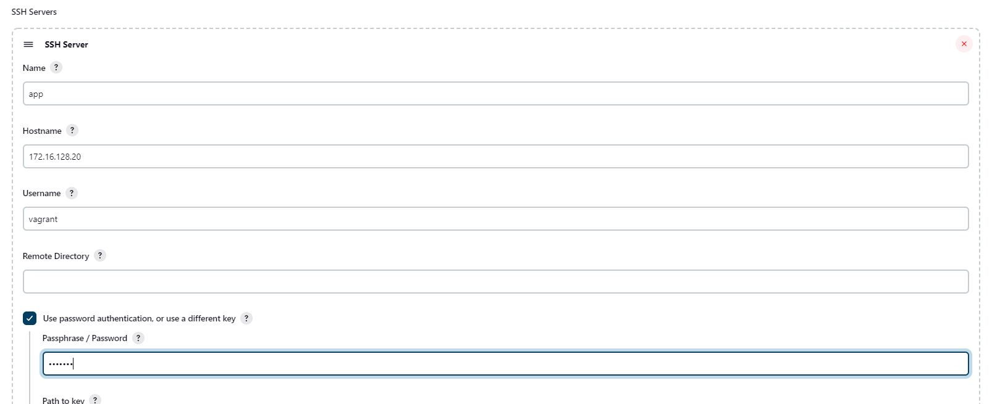
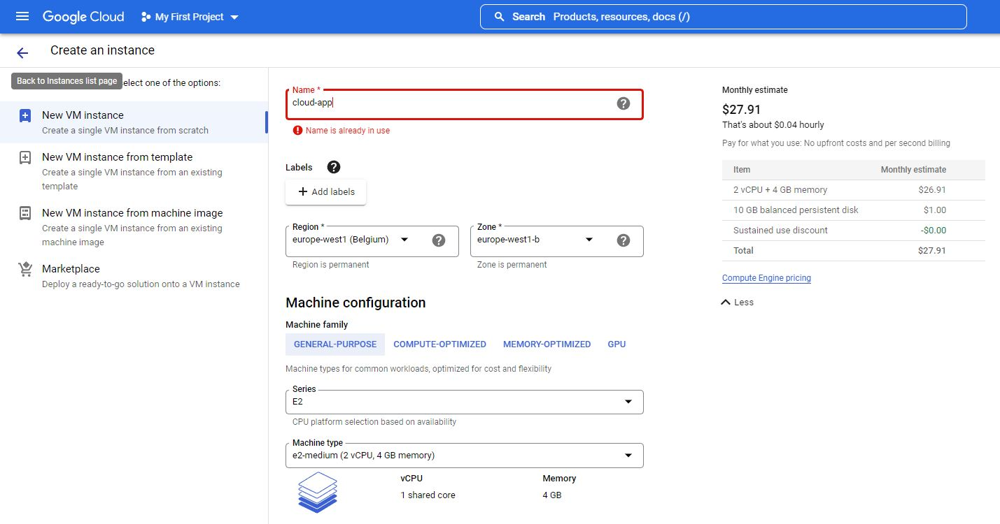

# Procedeurehandleiding
Deze handleiding toont aan hoe men de .NET applicatie van de casus geautomatiseerd kan opzetten met minimale configuratie in een lokale en- cloud-omgeving.

## Inhoudstafel

- [Procedeurehandleiding](#procedeurehandleiding)
  - [Inhoudstafel](#inhoudstafel)
  - [Lokale omgeving](#lokale-omgeving)
    - [Opzetten lokale Ubuntu VM's](#opzetten-lokale-ubuntu-vms)
    - [Configuratie Jenkins](#configuratie-jenkins)
      - [Intiële configuratie:](#intiële-configuratie)
      - [Publish over SSH configuratie:](#publish-over-ssh-configuratie)
      - [Preperation job:](#preperation-job)
      - [Build job:](#build-job)
      - [Pipeline:](#pipeline)
    - [Resultaat lokale omgeving](#resultaat-lokale-omgeving)
  - [Cloud-omgeving](#cloud-omgeving)
    - [Opzetten VM in Google Cloud](#opzetten-vm-in-google-cloud)
    - [Configuratie Cloud VM](#configuratie-cloud-vm)
    - [Ansible playbook uitvoeren](#ansible-playbook-uitvoeren)
    - [Configuratie Jenkins](#configuratie-jenkins-1)
      - [publish-over-ssh-configuratie:](#publish-over-ssh-configuratie-1)
      - [Preperation Job:](#preperation-job-1)
      - [Build job:](#build-job-1)
      - [Pipeline:](#pipeline-1)
    - [Resultaat cloud-omgeving](#resultaat-cloud-omgeving)

## Lokale omgeving

Voor de lokale omgeving gebruiken we Vagrant op het host systeem. Deze software moet dus eerst geïstalleerd worden.
- [Vagrant download link](https://www.vagrantup.com/downloads)

Hoe deze opstelling gecreëerd is wordt in de [Technische documentatie](doc/techhnische-documentatie.md) beschreven.

### Opzetten lokale Ubuntu VM's

Met behulp van vagrant kunnen we de 2 VM's, `build` & `app`, makkelijk opzetten met 1 commando. In de hoofdmap van het project (waar de `Vagrantfile` zich bevindt) moet men het commando `vagrant up` uitvoeren in een terminalvenster. 

Dit zou de gewenste output zijn:

```
$ vagrant up
Bringing machine 'build' up with 'virtualbox' provider...
Bringing machine 'app' up with 'virtualbox' provider...
==> build: Importing base box 'gusztavvargadr/docker-linux'...
==> build: Matching MAC address for NAT networking...
==> build: Checking if box 'gusztavvargadr/docker-linux' version '2010.2004.2208' is up to date...
==> build: Setting the name of the VM: Project_build_1660762832089_87495
==> build: Clearing any previously set network interfaces...
==> build: Preparing network interfaces based on configuration...
    build: Adapter 1: nat
    build: Adapter 2: hostonly
==> build: Forwarding ports...
    build: 22 (guest) => 2222 (host) (adapter 1)
==> build: Running 'pre-boot' VM customizations...
==> build: Booting VM...
==> build: Waiting for machine to boot. This may take a few minutes...
    build: SSH address: 127.0.0.1:2222
    build: SSH username: vagrant
    build: SSH auth method: private key
    build:
    build: Vagrant insecure key detected. Vagrant will automatically replace
    build: this with a newly generated keypair for better security.
    build:
    build: Inserting generated public key within guest...
    build: Removing insecure key from the guest if it's present...
    build: Key inserted! Disconnecting and reconnecting using new SSH key...
==> build: Machine booted and ready!
==> build: Checking for guest additions in VM...
==> build: Setting hostname...
==> build: Configuring and enabling network interfaces...
==> build: Mounting shared folders...
    build: /vagrant => C:/Users/Maximiliaan/Documents/School/3de Jaar/DevOps/2de zit/Project
==> build: Running provisioner: shell...
    build: Running: inline script
==> build: Running provisioner: shell...
    build: Running: inline script
==> build: Running provisioner: ansible_local...
    build: Installing Ansible...
    build: Running ansible-playbook...

PLAY [build] *******************************************************************

TASK [Gathering Facts] *********************************************************
ok: [build]

TASK [geerlingguy.java : Include OS-specific variables for Fedora or FreeBSD.] ***
skipping: [build]

TASK [geerlingguy.java : Include version-specific variables for CentOS/RHEL.] ***
skipping: [build]

TASK [geerlingguy.java : Include version-specific variables for Ubuntu.] *******
ok: [build]

TASK [geerlingguy.java : Include version-specific variables for Debian.] *******
ok: [build]

TASK [geerlingguy.java : Define java_packages.] ********************************
skipping: [build]

TASK [geerlingguy.java : include_tasks] ****************************************
skipping: [build]

TASK [geerlingguy.java : include_tasks] ****************************************
included: /vagrant/ansible/roles/geerlingguy.java/tasks/setup-Debian.yml for build

TASK [geerlingguy.java : Ensure 'man' directory exists.] ***********************
changed: [build]

TASK [geerlingguy.java : Ensure Java is installed.] ****************************
changed: [build]

TASK [geerlingguy.java : include_tasks] ****************************************
skipping: [build]

TASK [geerlingguy.java : Set JAVA_HOME if configured.] *************************
skipping: [build]

TASK [geerlingguy.jenkins : Include OS-Specific variables] *********************
ok: [build]

TASK [geerlingguy.jenkins : Define jenkins_repo_url] ***************************
ok: [build]

TASK [geerlingguy.jenkins : Define jenkins_repo_key_url] ***********************
ok: [build]

TASK [geerlingguy.jenkins : Define jenkins_pkg_url] ****************************
ok: [build]

TASK [geerlingguy.jenkins : include_tasks] *************************************
skipping: [build]

TASK [geerlingguy.jenkins : include_tasks] *************************************
included: /vagrant/ansible/roles/geerlingguy.jenkins/tasks/setup-Debian.yml for build

TASK [geerlingguy.jenkins : Ensure dependencies are installed.] ****************
ok: [build]

TASK [geerlingguy.jenkins : Add Jenkins apt repository key.] *******************
changed: [build]

TASK [geerlingguy.jenkins : Add Jenkins apt repository.] ***********************
changed: [build]

TASK [geerlingguy.jenkins : Download specific Jenkins version.] ****************
skipping: [build]

TASK [geerlingguy.jenkins : Check if we downloaded a specific version of Jenkins.] ***
skipping: [build]

TASK [geerlingguy.jenkins : Install our specific version of Jenkins.] **********
skipping: [build]

TASK [geerlingguy.jenkins : Ensure Jenkins is installed.] **********************
changed: [build]

TASK [geerlingguy.jenkins : include_tasks] *************************************
included: /vagrant/ansible/roles/geerlingguy.jenkins/tasks/settings.yml for build

TASK [geerlingguy.jenkins : Check if jenkins_init_file exists.] ****************
ok: [build]

TASK [geerlingguy.jenkins : Ensure jenkins_init_file exists.] ******************
skipping: [build]

TASK [geerlingguy.jenkins : Modify variables in init file.] ********************
changed: [build] => (item={'option': 'JENKINS_ARGS', 'value': '--prefix='})
changed: [build] => (item={'option': 'JAVA_ARGS', 'value': '-Djenkins.install.runSetupWizard=false'})

TASK [geerlingguy.jenkins : Ensure jenkins_home /var/lib/jenkins exists.] ******
ok: [build]

TASK [geerlingguy.jenkins : Set the Jenkins home directory.] *******************
changed: [build]

TASK [geerlingguy.jenkins : Immediately restart Jenkins on init config changes.] ***
changed: [build]

TASK [geerlingguy.jenkins : Set HTTP port in Jenkins config.] ******************
ok: [build]

TASK [geerlingguy.jenkins : Create custom init scripts directory.] *************
changed: [build]

TASK [geerlingguy.jenkins : Configure proxy config for Jenkins] ****************
skipping: [build]

TASK [geerlingguy.jenkins : Trigger handlers immediately in case Jenkins was installed] ***

RUNNING HANDLER [geerlingguy.jenkins : configure default users] ****************
changed: [build]

TASK [geerlingguy.jenkins : Immediately restart Jenkins on http or user changes.] ***
changed: [build]

TASK [geerlingguy.jenkins : Ensure Jenkins is started and runs on startup.] ****
ok: [build]

TASK [geerlingguy.jenkins : Wait for Jenkins to start up before proceeding.] ***
ok: [build]

TASK [geerlingguy.jenkins : Get the jenkins-cli jarfile from the Jenkins server.] ***
changed: [build]

TASK [geerlingguy.jenkins : Remove Jenkins security init scripts after first startup.] ***
changed: [build]

TASK [geerlingguy.jenkins : include_tasks] *************************************
included: /vagrant/ansible/roles/geerlingguy.jenkins/tasks/plugins.yml for build

TASK [geerlingguy.jenkins : Get Jenkins admin password from file.] *************
skipping: [build]

TASK [geerlingguy.jenkins : Set Jenkins admin password fact.] ******************
ok: [build]

TASK [geerlingguy.jenkins : Create Jenkins updates directory.] *****************
ok: [build]

TASK [geerlingguy.jenkins : Download current plugin updates from Jenkins update site.] ***
ok: [build]

TASK [geerlingguy.jenkins : Remove first and last line from json file.] ********
ok: [build]

TASK [geerlingguy.jenkins : Install Jenkins plugins using password.] ***********
changed: [build] => (item=publish-over)
changed: [build] => (item=publish-over-ssh)

RUNNING HANDLER [geerlingguy.jenkins : restart jenkins] ************************
changed: [build]

PLAY [app] *********************************************************************
skipping: no hosts matched

PLAY RECAP *********************************************************************
build                      : ok=36   changed=15   unreachable=0    failed=0    skipped=13   rescued=0    ignored=0

==> app: Importing base box 'gusztavvargadr/docker-linux'...
==> app: Matching MAC address for NAT networking...
==> app: Checking if box 'gusztavvargadr/docker-linux' version '2010.2004.2208' is up to date...
==> app: Setting the name of the VM: Project_app_1660763304938_42817
==> app: Fixed port collision for 22 => 2222. Now on port 2200.
==> app: Clearing any previously set network interfaces...
==> app: Preparing network interfaces based on configuration...
    app: Adapter 1: nat
    app: Adapter 2: hostonly
==> app: Forwarding ports...
    app: 22 (guest) => 2200 (host) (adapter 1)
==> app: Running 'pre-boot' VM customizations...
==> app: Booting VM...
==> app: Waiting for machine to boot. This may take a few minutes...
    app: SSH address: 127.0.0.1:2200
    app: SSH username: vagrant
    app: SSH auth method: private key
    app:
    app: Vagrant insecure key detected. Vagrant will automatically replace
    app: this with a newly generated keypair for better security.
    app:
    app: Inserting generated public key within guest...
    app: Removing insecure key from the guest if it's present...
    app: Key inserted! Disconnecting and reconnecting using new SSH key...
==> app: Machine booted and ready!
==> app: Checking for guest additions in VM...
==> app: Setting hostname...
==> app: Configuring and enabling network interfaces...
==> app: Mounting shared folders...
    app: /vagrant => C:/Users/Maximiliaan/Documents/School/3de Jaar/DevOps/2de zit/Project
==> app: Running provisioner: shell...
    app: Running: inline script
==> app: Running provisioner: shell...
    app: Running: inline script
==> app: Running provisioner: ansible_local...
    app: Installing Ansible...
    app: Running ansible-playbook...

PLAY [build] *******************************************************************
skipping: no hosts matched

PLAY [app] *********************************************************************

TASK [Gathering Facts] *********************************************************
ok: [app]

TASK [Make project directory] **************************************************
changed: [app]

TASK [Copy docker-compose file to project directory] ***************************
changed: [app]

PLAY RECAP *********************************************************************
app                        : ok=3    changed=2    unreachable=0    failed=0    skipped=0    rescued=0    ignored=0
```

### Configuratie Jenkins

#### Intiële configuratie:

Surf naar `172.16.128.10` en log in met username `admin` en password `root`. Installeer de aanbevolen plugins en nadat Jenkins geinitialiseerd is kom je op een pagina "Instance Configuration". Hier klik je gewoon op "Save and Finish" en dan op "Start using Jenkins".

#### Publish over SSH configuratie:

Om de applicatie met Jenkins te bouwen op de applicatieserver gebruiken we de Jenkins plugin `Publish over SSH`. We moeten dus de app server toevoegen als een SSH server in Jenkins

Klik op "Beheer Jenkins" en dan op "Configureer Systeem"


Scroll naar `Publish over SSH` (helemaal onderaan) en naast SSH servers klik op toevoegen.
Vul naam, hostnaam, gebruikersnaam en passwoord in zoals hier onder. Klik tenslotte op opslaan.

- Name: `app`
- Hostname(IP): `172.16.128.20`
- Username: `vagrant`
- Password: `vagrant`



We gebruiken de user vagrant om via SSH bestanden en commando's naar de app server te sturen.

#### Preperation job:

We kiezen een nieuwe job met vrije stijl en noemen hem `Preperation`.


Onder "Bouwomgeving" klikken we "Send files or execute commands over SSH after the build runs" aan en kiezen we bij SSH server de eerder geconfigureerde "app" server. Bij "Exec command" vullen we `docker stop app; docker rm app; docker image rm dotnet:app` in.


Deze job zorgt ervoor dat als de container al draait, deze eerst gestopt wordt en daarna verwijderd. Tenslotte wordt de image ook verwijdert zodat de build job deze opnieuw kan builden met de nieuwe aanpassingen.

#### Build job:

We kiezen opnieuw een nieuwe job met vrije stijl en noemen hem `buildApp`. Bij "Broncodebeheer (SCM)" kiezen we voor "Git". Als "Repository URL" geven we `https://github.com/MaximiliaanM/csharp-ch-9-exercise-1.git`. We hoeven geen credentials te gebruiken aangezien de repo public is. Als "Branches to build" kiezen we voor `solution` zoals gevraagd in de casus.


Onder "Bouwomgeving" klikken we opnieuw "Send files or execute commands over SSH after the build runs" aan en kiezen we bij SSH server de eerder geconfigureerde "app" server. Bij "Source files" zetten we `**`. Dit haalt alles op in de map Workspace van Jenkins waar we net onze Github repo in hebben gepulled. Als "Remote directory" zetten we `project/csharp-ch-9-exercise-1/`. Dit is de project map die we via ansible hebben aangemaakt en ook waar onze docker-compose file staat. Als "Exec command" vullen we `cd project && docker-compose up -d`. Dit gaat naar de hoofdmap van het project en voert de `docker-compose.yml` file uit om de applicatie te bouwen. Als laatste zetten wet "Exec timeout (ms)" op 0 zodat de SSH connectie niet verbroken wordt door de de lange build tijd.


#### Pipeline:

We maken een nieuw item aan, deze keer een pipeline en we noemen hem `appPipeline`. Bij "Pipeline" geven we het volgende script op:

```sh
node {

    stage('Preperation') {
        build 'Preperation'
    }
    stage('Build') {
        build 'buildApp'
    }
}
```
Als we deze pipeline uitvoeren dan zou de .Net applicatie moeten opstaan op de app server.

### Resultaat lokale omgeving

De applicatie is zichtbaar op `http://172.16.128.20`


---

## Cloud-omgeving

### Opzetten VM in Google Cloud

Nadat je een account hebt aangemaakt op Google Cloud, ga je naar "Compute Engine" en kies je voor "VM Instance" onder "Virtual Machines" in het linker menu. Klik bovenaan op "Create Instance" om een nieuwe VM te configureren. Vul volgende vereisten in en klik onderaan op "create" om door te gaan.

- Name:  `cloud-app`
- Region: `europe-west1 (Belgium)`
- Series: `E2`
- Machinetype: `e2-medium (2 vCPU, 4 GB memory)`
- Firewall: `Allow HTTP traffic`



### Configuratie Cloud VM

Voor de simpliciteit van de casus te behouden loggen we in over SSH met passwoord zonder key checking. Dit is een security risk voor onze cloud VM, waarbij ze met bruteforce attacks makkelijk binnen raken. We opteren dus om de ssh poort (22) naar een andere poort te sturen (4965)

In Google Cloud Dashboard, kies voor "VPC Network" en selecteer "Firewall" in het linker menu. Bewerk de "default-allow-ssh" rule en voeg poort 4965 toe aan "Ports"


Login op de VM en bewerk het bestand `/etc/ssh/sshd_config` met een tekst editor. Haal `Port=22` uit commentaar en verander de poort van 22 naar 4965. `PermitRootLogin` zetten we op no (veiligheids reden). `PasswordAuthentication` zetten we op yes (om te kunnen inloggen)

Sla het bestand op en voer `systemctl restart sshd` uit om de service te herstarten met de nieuwe waarden.

```bash
#       $OpenBSD: sshd_config,v 1.103 2018/04/09 20:41:22 tj Exp $

# This is the sshd server system-wide configuration file.  See
# sshd_config(5) for more information.

# This sshd was compiled with PATH=/usr/bin:/bin:/usr/sbin:/sbin

# The strategy used for options in the default sshd_config shipped with
# OpenSSH is to specify options with their default value where
# possible, but leave them commented.  Uncommented options override the
# default value.

Include /etc/ssh/sshd_config.d/*.conf

Port 4965
#AddressFamily any
#ListenAddress 0.0.0.0
#ListenAddress ::

#HostKey /etc/ssh/ssh_host_rsa_key
#HostKey /etc/ssh/ssh_host_ecdsa_key
#HostKey /etc/ssh/ssh_host_ed25519_key

# Ciphers and keying
#RekeyLimit default none

# Logging
#SyslogFacility AUTH
#LogLevel INFO

# Authentication:

#LoginGraceTime 2m
PermitRootLogin no
#StrictModes yes
#MaxAuthTries 6
#MaxSessions 10

#PubkeyAuthentication yes

# Expect .ssh/authorized_keys2 to be disregarded by default in future.
#AuthorizedKeysFile     .ssh/authorized_keys .ssh/authorized_keys2

#AuthorizedPrincipalsFile none

#AuthorizedKeysCommand none
#AuthorizedKeysCommandUser nobody

# For this to work you will also need host keys in /etc/ssh/ssh_known_hosts
#HostbasedAuthentication no
# Change to yes if you don't trust ~/.ssh/known_hosts for
# HostbasedAuthentication
#IgnoreUserKnownHosts no
# Don't read the user's ~/.rhosts and ~/.shosts files
#IgnoreRhosts yes

# To disable tunneled clear text passwords, change to no here!
PasswordAuthentication yes
#PermitEmptyPasswords no

# Change to yes to enable challenge-response passwords (beware issues with
# some PAM modules and threads)
ChallengeResponseAuthentication no

# Kerberos options
#KerberosAuthentication no
#KerberosOrLocalPasswd yes
#KerberosTicketCleanup yes
#KerberosGetAFSToken no

# GSSAPI options
#GSSAPIAuthentication no
#GSSAPICleanupCredentials yes
#GSSAPIStrictAcceptorCheck yes
#GSSAPIKeyExchange no

# Set this to 'yes' to enable PAM authentication, account processing,
# and session processing. If this is enabled, PAM authentication will
# be allowed through the ChallengeResponseAuthentication and
# PasswordAuthentication.  Depending on your PAM configuration,
# PAM authentication via ChallengeResponseAuthentication may bypass
# the setting of "PermitRootLogin without-password".
# If you just want the PAM account and session checks to run without
# PAM authentication, then enable this but set PasswordAuthentication
# and ChallengeResponseAuthentication to 'no'.
UsePAM yes

#AllowAgentForwarding yes
#AllowTcpForwarding yes
#GatewayPorts no
X11Forwarding yes
#X11DisplayOffset 10
#X11UseLocalhost yes
#PermitTTY yes
PrintMotd no
#PrintLastLog yes
#TCPKeepAlive yes
#PermitUserEnvironment no
#Compression delayed
#ClientAliveInterval 0
#ClientAliveCountMax 3
#UseDNS no
#PidFile /var/run/sshd.pid
#MaxStartups 10:30:100
#PermitTunnel no
#ChrootDirectory none
#VersionAddendum none

# no default banner path
#Banner none

# Allow client to pass locale environment variables
AcceptEnv LANG LC_*

# override default of no subsystems
Subsystem       sftp    /usr/lib/openssh/sftp-server

# Example of overriding settings on a per-user basis
#Match User anoncvs
#       X11Forwarding no
#       AllowTcpForwarding no
#       PermitTTY no
#       ForceCommand cvs server
```

Nu gaan we Docker en docker-compose installeren op de VM.  Voer volgende commando's uit:

```shell
$ sudo apt update
$ sudo apt install apt-transport-https ca-certificates curl software-properties-common
$ curl -fsSL https://download.docker.com/linux/ubuntu/gpg | sudo apt-key add -
$ sudo add-apt-repository "deb [arch=amd64] https://download.docker.com/linux/ubuntu focal stable"
$ apt-cache policy docker-ce
$ sudo apt install docker-ce
$ sudo usermod -aG docker vagrant
$ docker --version

$ sudo curl -L "https://github.com/docker/compose/releases/download/1.29.2/docker-compose-$(uname -s)-$(uname -m)" -o /usr/local/bin/docker-compose
$ sudo chmod +x /usr/local/bin/docker-compose
$ docker-compose --version
```

Vervolgens gaan we de user vagrant aanmaken zodat we ons ansible playbook kunnen hergebruiken. We voegen de user toe aan de groepen docker en admin zodat ze deze rechten krijgen. Tenslotte passen we `/etc/sudoers` aan zodat users van de groep admin geen passwoord moeten geven. Dit doen we omdat ansible dan niet kan inloggen over SSH om het playbook te kunnen uitvoeren.

```shell
$ adduser vagrant
$ usermod -aG docker vagrant
$ usermod -aG admin vagrant
$ vi /etc/sudoers
```

```bash
#
# This file MUST be edited with the 'visudo' command as root.
#
# Please consider adding local content in /etc/sudoers.d/ instead of
# directly modifying this file.
#
# See the man page for details on how to write a sudoers file.
#
Defaults        env_reset
Defaults        mail_badpass
Defaults        secure_path="/usr/local/sbin:/usr/local/bin:/usr/sbin:/usr/bin:/sbin:/bin:/snap/bin"

# Host alias specification

# User alias specification

# Cmnd alias specification

# User privilege specification
root    ALL=(ALL:ALL) ALL

# Members of the admin group may gain root privileges
%admin ALL = NOPASSWD:  ALL

# Allow members of group sudo to execute any command
%sudo   ALL=(ALL:ALL) ALL

# See sudoers(5) for more information on "#include" directives:

#includedir /etc/sudoers.d
```

### Ansible playbook uitvoeren

Om Ansible te kunnen draaien op Windows hebben we eerst een WSL nodig. We opteren voor een Ubuntu 20.04 LTS WSL (makkelijk te downloaden via Microsoft store). Als de WSL gebruiksklaar is, installeren we Ansible en sshpass (dependency).

```shell
$ apt update
$ apt install ansible
$ apt install sshpass
$ ansible --version
ansible 2.10.8
  config file = None
  configured module search path = ['/root/.ansible/plugins/modules', '/usr/share/ansible/plugins/modules']
  ansible python module location = /usr/lib/python3/dist-packages/ansible
  executable location = /usr/bin/ansible
  python version = 3.10.4 (main, Jun 29 2022, 12:14:53) [GCC 11.2.0]
```

Voordat we Ansible over SSH uitvoeren, moeten we de SSH key van de build server toevoegen aan de host. Dit kunnen we eenvoudig doen door 1 keer manueel van de build server naar de cloud VM te SSH'en.

```shell
$ ssh vagrant@35.205.200.50
```

We navigeren naar de map `cloud-vm` in ons project via de mount folder `mnt` (met de WSL op host systeem). Daarna voeren we het playbook uit met `ansible-playbook -i inventory playbook.yml -u vagrant -k`

```shell
$ cd mnt/c/Users/Maximiliaan/Documents/School/3de\ Jaar/DevOps/2de\ zit/Project/cloud-vm/
$ ansible-playbook -i inventory playbook.yml -u vagrant -k
```

### Configuratie Jenkins

#### publish-over-ssh-configuratie:

We voegen in de Jenkins instelligen opnieuw een SSH server toe. Vul deze gegevens in en klik op opslaan.

- Name: `cloudApp`
- Hostname(IP): `35.205.200.50`
- Username: `vagrant`
- Password: `vagrant`
- Port: `4965`

#### Preperation Job:

We kiezen een nieuwe job met vrije stijl en noemen hem `PreperationCloud`.
Onder "Bouwomgeving" klikken we "Send files or execute commands over SSH after the build runs" aan en kiezen we bij SSH server de nieuw geconfigureerde "cloudApp" server. Bij "Exec command" vullen we `docker stop app; docker rm app; docker image rm dotnet:app` in.


#### Build job:

We kiezen opnieuw een nieuwe job met vrije stijl en noemen hem `buildCloudApp`. Bij "Broncodebeheer (SCM)" kiezen we voor "Git". Als "Repository URL" geven we `https://github.com/MaximiliaanM/csharp-ch-9-exercise-1.git`. We hoeven geen credentials te gebruiken aangezien de repo public is. Als "Branches to build" kiezen we voor `solution` zoals gevraagd in de casus.


Onder "Bouwomgeving" klikken we opnieuw "Send files or execute commands over SSH after the build runs" aan en kiezen we bij SSH server de eerder geconfigureerde "app" server. Bij "Source files" zetten we `**`. Dit haalt alles op in de map Workspace van Jenkins waar we net onze Github repo in hebben gepulled. Als "Remote directory" zetten we `project/csharp-ch-9-exercise-1/`. Dit is de project map die we via ansible hebben aangemaakt en ook waar onze docker-compose file staat. Als "Exec command" vullen we `cd project && docker-compose up -d`. Dit gaat naar de hoofdmap van het project en voert de `docker-compose.yml` file uit om de applicatie te bouwen. Als laatste zetten wet "Exec timeout (ms)" op 0 zodat de SSH connectie niet verbroken wordt door de de lange build tijd.


#### Pipeline:

We maken een nieuw item aan, deze keer een pipeline en we noemen hem `appCloudPipeline`. Bij "Pipeline" geven we het volgende script op:

```sh
node {

    stage('PreperationCloud') {
        build 'PreperationCloud'
    }
    stage('Build') {
        build 'buildCloudApp'
    }
}
```
Als we deze pipeline uitvoeren dan zou de .Net applicatie moeten opstaan op de app server.

### Resultaat cloud-omgeving

De applicatie is zichtbaar op `http://35.205.200.50/`

