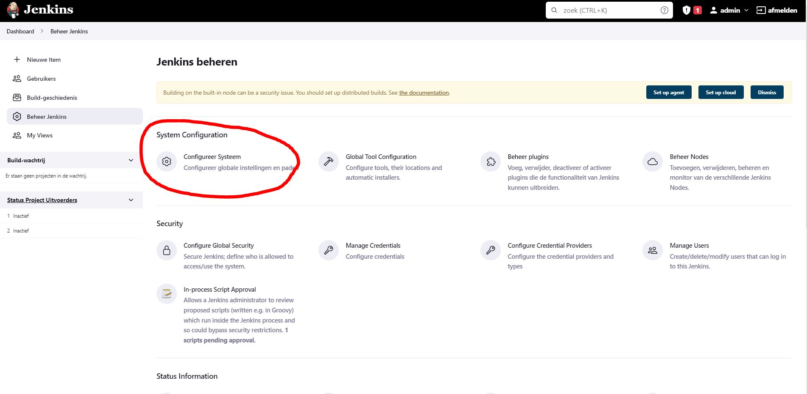
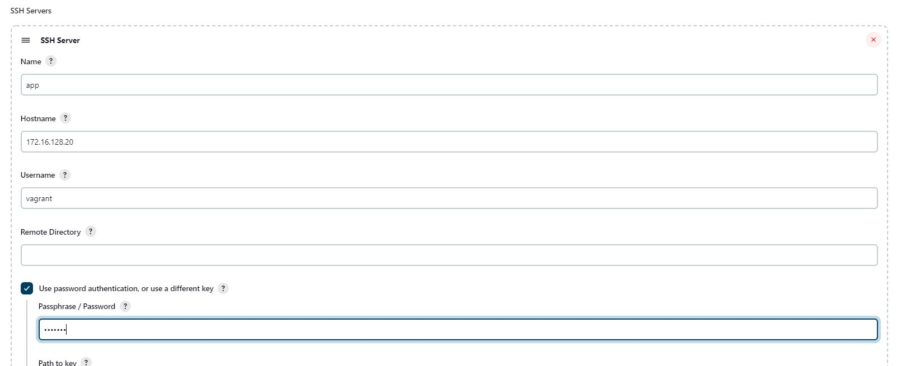
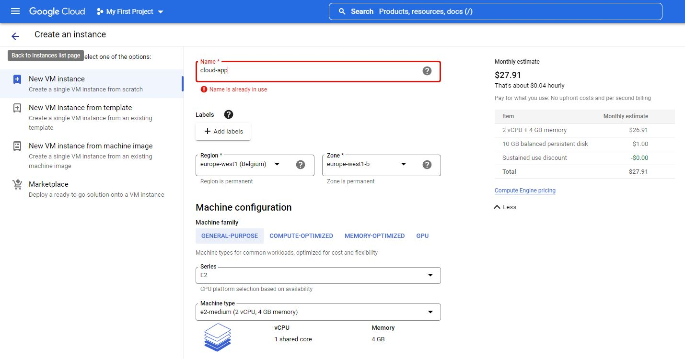
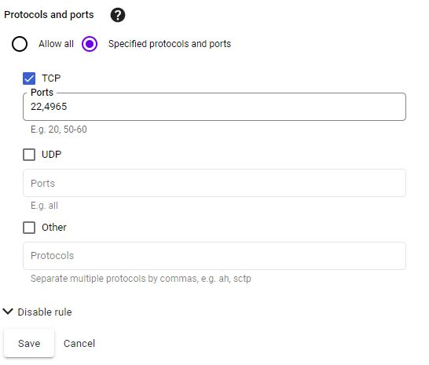

# Technische Documentatie
- [Technische Documentatie](#technische-documentatie)
  - [Keuze van de tools & cloudplatform](#keuze-van-de-tools--cloudplatform)
  - [Configuratie lokale omgeving](#configuratie-lokale-omgeving)
    - [Playbook](#playbook)
    - [Build server](#build-server)
      - [Ansible host variabelen:](#ansible-host-variabelen)
      - [Jenkins configuratie:](#jenkins-configuratie)
    - [Applicatieserver](#applicatieserver)
  - [Configuratie Cloudplatform](#configuratie-cloudplatform)
    - [Playbook](#playbook-1)
    - [Build server](#build-server-1)
      - [Jenkins configuratie:](#jenkins-configuratie-1)
    - [Applicatieserver](#applicatieserver-1)
      - [Opzetten VM in Google Cloud:](#opzetten-vm-in-google-cloud)
      - [Configuratie Cloud VM:](#configuratie-cloud-vm)
      - [Installatie Docker & docker-compose op cloud VM:](#installatie-docker--docker-compose-op-cloud-vm)
      - [Vagrant user toevoegen aan cloud VM en toevoegen aan juiste groepen:](#vagrant-user-toevoegen-aan-cloud-vm-en-toevoegen-aan-juiste-groepen)
      - [/etc/sudoers aanpassen voor passwordless privileges admin groep](#etcsudoers-aanpassen-voor-passwordless-privileges-admin-groep)
      - [Build applicatie](#build-applicatie)
## Keuze van de tools & cloudplatform
Voor de uitwerking van deze casus heb ik gekozen om met `Docker` te werken, hhier heb ik al reeds ervaring mee en tevens werd het project van de eerste examenperiode hier ook mee gerealiseerd.

Voor het cloudplatform koos ik voor `Google Cloud`. Mijn Azure credits zijn reeds opgebruikt in de 1ste examen periode en Google Cloud bied $300 aan credits aan voor studenten. Ook was ik geïnteresseerd om met het platform te werken.

## Configuratie lokale omgeving
De opdracht vermeld dat we 2 servers moeten opzetten, een build server en een applicatieserver. Deze werden toegevoegd aan de `vagrant-hosts.yml` file als `build` en `app` als vagrant box gebruiken we een [Ubuntu machine met Docker reeds geïnstalleerd](https://app.vagrantup.com/gusztavvargadr/boxes/docker-linux). Dit configureren we in de `Vagrantfile` bij `DEFAULT_BASE_BOX`.

```yaml
# vagrant-host.yml
- name: build
  ip: 172.16.128.10
  netmask: 255.255.255.0
- name: app
  ip: 172.16.128.20
  netmask: 255.255.255.0
```

```bash
# Vagrantfile
# Set your default base box here
DEFAULT_BASE_BOX = 'gusztavvargadr/docker-linux'
```

### Playbook 

In het playbook `site.yml` configureren we de Asible roles en taken die we moeten uitvoeren.

Bij de build server opteren we voor een role om jenkins te installeren en te configureren.

Bij de app server maken we een folder aan waar de source files voor het project zullen komen. Ook kopieëren we de `docker-compose.yml` file naar de VM.

```yaml
# site.yml
---

- hosts: build
  become: true
  roles:
    - geerlingguy.java
    - geerlingguy.jenkins
  tasks:
    - name: copy SSH config file to VM
      copy:
        src: files/config
        dest: /home/vagrant/.ssh/
    - name: Portforward port 80 to 8080 with iptables
      shell: iptables -t nat -A PREROUTING -p tcp --dport 80 -j DNAT --to-destination 172.16.128.10:8080

- hosts: app
  become: true
  tasks:
    - name: copy SSH config file to VM
      copy:
        src: files/config
        dest: /home/vagrant/.ssh/
    - name: Make project directory
      file: 
        path: /home/vagrant/project
        state: directory
        owner: vagrant
        group: vagrant
    - name: Copy docker-compose file to project directory
      copy:
        src: files/docker-compose.yml
        dest: /home/vagrant/project/
```

### Build server
#### Ansible host variabelen:

```yaml
# build.yml
---
jenkins_package_state: latest
jenkins_hostname: localhost
jenkins_http_port: 8080
jenkins_admin_username: admin
jenkins_admin_password: root

jenkins_plugins:
  - publish-over
  - publish-over-ssh
jenkins_plugins_install_dependencies: true
jenkins_plugins_state: latest

java_packages:
  - openjdk-8-jdk
  - openjdk-11-jdk
```
- `latest` om de nieuwste versie te gebruiken
- `localhost` als hostname
- `8080` als poort nummer
- `admin` als inlog username
- `root` als inlog password
- `publish-over` & `publish-over-ssh` als nodige plugins om de app server remotely te kunnen builden
-  `openjdk-8-jdk` & `openjdk-11-jdk` als nodige java packages om de role te laten werken
  
#### Jenkins configuratie:

Om de applicatie met Jenkins te bouwen op de applicatieserver gebruiken we de Jenkins plugin `Publish over SSH`. We moeten dus de app server toevoegen als een SSH server in Jenkins

Klik op "Beheer Jenkins" en dan op "Configureer Systeem"


Scroll naar `Publish over SSH` (helemaal onderaan) en naast SSH servers klik op toevoegen.
Vul naam, hostnaam, gebruikersnaam en passwoord in zoals hier onder. Klik tenslotte op opslaan.

- Name: `app`
- Hostname(IP): `172.16.128.20`
- Username: `vagrant`
- Password: `vagrant`



We gebruiken de user vagrant om via SSH bestanden en commando's naar de app server te sturen.

### Applicatieserver

Om de applicatie te builden gebruiken we Docker. We maken een nieuwe Dockerfile aan met volgende code:

```Dockerfile
# asp.net SDK versie 5.0
FROM mcr.microsoft.com/dotnet/aspnet:5.0 As base
WORKDIR /app
EXPOSE 80
ENV ASPNETCORE_URLS=http://+:80

# Copy csproj and restore as distinct layers
FROM mcr.microsoft.com/dotnet/sdk:5.0 AS build
WORKDIR /
COPY ./SportStore.sln ./
COPY ./src/Domain/Domain.csproj ./src/Domain/
COPY ./src/Services/Services.csproj ./src/Services/
COPY ./src/Persistence/Persistence.csproj ./src/Persistence/
COPY ./src/Server/Server.csproj ./src/Server/
COPY ./src/Shared/Shared.csproj ./src/Shared/
COPY ./src/Client/Client.csproj ./src/Client/
RUN dotnet restore

# Copy everything else and build app
COPY ./ ./
COPY ./src/Domain/ ./src/Domain/
COPY ./src/Services/ ./src/Services/
COPY ./src/Persistence/ ./src/Persistence/
COPY ./src/Server/ ./src/Server/
COPY ./src/Shared/ ./src/Shared/
COPY ./src/Client/ ./src/Client/


WORKDIR /src/Domain
RUN dotnet build -c Release -o /app/out
WORKDIR /src/Services
RUN dotnet build -c Release -o /app/out
WORKDIR /src/Persistence
RUN dotnet build -c Release -o /app/out
WORKDIR /src/Server
RUN dotnet build -c Release -o /app/out
WORKDIR /src/Shared
RUN dotnet build -c Release -o /app/out
WORKDIR /src/Client
RUN dotnet build -c Release -o /app/out
WORKDIR /
RUN dotnet build -c Release -o /app/out

FROM build AS publish
RUN dotnet publish -c Release -o /app/out

# Build runtime image
FROM mcr.microsoft.com/dotnet/aspnet:5.0 AS runtime
WORKDIR /app
COPY --from=publish /app/out .
ENTRYPOINT ["dotnet", "Server.dll"]
```

Deze Dockerfile maakt een docker image van de .NET app. We zetten de Dockerfile in de github repository naast `SportStore.sln` op de solution branch. Zo staat die altijd goed als het project wordt binnengehaald door Jenkins.

Om de .NET app van een image in een werkende container om te zetten gebruiken we docker-compose.
Maak een `docker-compose.yml` file aan in de map files met volgende code:

```yaml
version: '2.0'
services:
  app:
    build:
      context: csharp-ch-9-exercise-1
      dockerfile: Dockerfile
    image: dotnet:app
    restart: always
    container_name: app
    ports:
      - 80:80
  db:
    image: "mcr.microsoft.com/mssql/server"
    container_name: db
    environment:
      SA_PASSWORD: "yourStrong(!)Password"
      ACCEPT_EULA: "Y"
  portainer:
    image: portainer/portainer-ce
    restart: always
    container_name: Portainer
    ports:
      - 9000:9000
    command: -H unix:///var/run/docker.sock
    volumes:
      - /var/run/docker.sock:/var/run/docker.sock
      - portainer_data:/data

volumes:
  db:
  portainer_data:
```

We draaien 3 service's:
- app
- db
- portainer

app is onze .NET applicatie waar we onze eerder geschreven Dockerfile specifiëren. We geven de image een naam en zetten de app op poort 80.

db is onze database voor de .NET app. Dit is een Microsoft SQL server omdat MySQL niet kon gebruikt worden tenzij de connectionstring in het project werd aangepast. Dit is niet deel van de casus dus heb ik geopteerd om Microsoft SQL te gebruiken. De connectionstring in het .NET project werd als volgt aangepast in `src/Server/appsettings.json`.

```json
"ConnectionStrings": {
    "SportStore": "Server=db;Database=SportStore;User=sa;Password=yourStrong(!)Password;TrustServerCertificate=True;"
  }
```
Portainer is onze configuratie en monotoring tool voor de containers

---

## Configuratie Cloudplatform
### Playbook

We voegen een nieuwe map toe aan het project genaamd `cloud-vm`. We maken een nieuwe playbook, `playbook.yml`. Dit is een aparte playbook met dezelfde inhoud als die van de lokale omgeving. 

```yaml
# playbook.yml
---

- hosts: cloud
  become: true
  tasks:
    - name: copy SSH config file to VM
      copy:
        src: files/config
        dest: /home/vagrant/.ssh/
    - name: Make project directory
      file: 
        path: /home/vagrant/project
        state: directory
        owner: vagrant
        group: vagrant
    - name: Copy docker-compose file to project directory
      copy:
        src: files/docker-compose.yml
        dest: /home/vagrant/project/
```

We kopieren de nodige files (`docker-compose.yml` & `config`) naar deze map. We maken een inventory file aan waar we onze host en ssh poort specifiëren. 

```
[all]
cloud ansible_host=35.205.200.50 ansible_port=4965
```

De structuur van de map `cloud-vm` ziet u hieronder:

```shhell
$ tree cloud-vm/

cloud-vm/
├── ansible.cfg
├── files
│   ├── config
│   └── docker-compose.yml
├── inventory
└── playbook.yml

1 directory, 5 files
```

### Build server
#### Jenkins configuratie:

We voegen een nieuwe SSH server toe met volgende configuratie.

- Name: `cloudApp`
- Hostname(IP): `35.205.200.50`
- Username: `vagrant`
- Password: `vagrant`
- Port: `4965`

### Applicatieserver

#### Opzetten VM in Google Cloud:

Nadat je een account hebt aangemaakt op Google Cloud, ga je naar "Compute Engine" en kies je voor "VM Instance" onder "Virtual Machines" in het linker menu. Klik bovenaan op "Create Instance" om een nieuwe VM te configureren. Vul volgende vereisten in en klik onderaan op "create" om door te gaan.

- Name:  `cloud-app`
- Region: `europe-west1 (Belgium)`
- Series: `E2`
- Machinetype: `e2-medium (2 vCPU, 4 GB memory)`
- Firewall: `Allow HTTP traffic`



#### Configuratie Cloud VM:

Voor de simpliciteit van de casus te behouden loggen we in over SSH met passwoord zonder key checking. Dit is een security risk voor onze cloud VM, waarbij ze met bruteforce attacks makkelijk binnen raken. We opteren dus om de ssh poort (22) naar een andere poort te sturen (4965)

In Google Cloud Dashboard, kies voor "VPC Network" en selecteer "Firewall" in het linker menu. Bewerk de "default-allow-ssh" rule en voeg poort 4965 toe aan "Ports"



Login op de VM en bewerk het bestand `/etc/ssh/sshd_config` met een tekst editor. Haal `Port=22` uit commentaar en verander de poort van 22 naar 4965. `PermitRootLogin` zetten we op no (veiligheids reden). `PasswordAuthentication` zetten we op yes (om te kunnen inloggen)

Sla het bestand op en voer `systemctl restart sshd` uit om de service te herstarten met de nieuwe waarden.

#### Installatie Docker & docker-compose op cloud VM:

```shell
$ sudo apt update
$ sudo apt install apt-transport-https ca-certificates curl software-properties-common
$ curl -fsSL https://download.docker.com/linux/ubuntu/gpg | sudo apt-key add -
$ sudo add-apt-repository "deb [arch=amd64] https://download.docker.com/linux/ubuntu focal stable"
$ apt-cache policy docker-ce
$ sudo apt install docker-ce
$ sudo usermod -aG docker vagrant
$ docker --version

$ sudo curl -L "https://github.com/docker/compose/releases/download/1.29.2/docker-compose-$(uname -s)-$(uname -m)" -o /usr/local/bin/docker-compose
$ sudo chmod +x /usr/local/bin/docker-compose
$ docker-compose --version
```

#### Vagrant user toevoegen aan cloud VM en toevoegen aan juiste groepen:

```shell
$ adduser vagrant
$ usermod -aG docker vagrant
$ usermod -aG admin vagrant
$ vi /etc/sudoers
```

#### /etc/sudoers aanpassen voor passwordless privileges admin groep

```bash
#
# This file MUST be edited with the 'visudo' command as root.
#
# Please consider adding local content in /etc/sudoers.d/ instead of
# directly modifying this file.
#
# See the man page for details on how to write a sudoers file.
#
Defaults        env_reset
Defaults        mail_badpass
Defaults        secure_path="/usr/local/sbin:/usr/local/bin:/usr/sbin:/usr/bin:/sbin:/bin:/snap/bin"

# Host alias specification

# User alias specification

# Cmnd alias specification

# User privilege specification
root    ALL=(ALL:ALL) ALL

# Members of the admin group may gain root privileges
%admin ALL = NOPASSWD:  ALL

# Allow members of group sudo to execute any command
%sudo   ALL=(ALL:ALL) ALL

# See sudoers(5) for more information on "#include" directives:

#includedir /etc/sudoers.d
```

#### Build applicatie 

Om de applicatie te builden gebruiken we Docker. We gebruiken dezelfde Dockerfile als de lokale omgeving:

```Dockerfile
# asp.net SDK versie 5.0
FROM mcr.microsoft.com/dotnet/aspnet:5.0 As base
WORKDIR /app
EXPOSE 80
ENV ASPNETCORE_URLS=http://+:80

# Copy csproj and restore as distinct layers
FROM mcr.microsoft.com/dotnet/sdk:5.0 AS build
WORKDIR /
COPY ./SportStore.sln ./
COPY ./src/Domain/Domain.csproj ./src/Domain/
COPY ./src/Services/Services.csproj ./src/Services/
COPY ./src/Persistence/Persistence.csproj ./src/Persistence/
COPY ./src/Server/Server.csproj ./src/Server/
COPY ./src/Shared/Shared.csproj ./src/Shared/
COPY ./src/Client/Client.csproj ./src/Client/
RUN dotnet restore

# Copy everything else and build app
COPY ./ ./
COPY ./src/Domain/ ./src/Domain/
COPY ./src/Services/ ./src/Services/
COPY ./src/Persistence/ ./src/Persistence/
COPY ./src/Server/ ./src/Server/
COPY ./src/Shared/ ./src/Shared/
COPY ./src/Client/ ./src/Client/


WORKDIR /src/Domain
RUN dotnet build -c Release -o /app/out
WORKDIR /src/Services
RUN dotnet build -c Release -o /app/out
WORKDIR /src/Persistence
RUN dotnet build -c Release -o /app/out
WORKDIR /src/Server
RUN dotnet build -c Release -o /app/out
WORKDIR /src/Shared
RUN dotnet build -c Release -o /app/out
WORKDIR /src/Client
RUN dotnet build -c Release -o /app/out
WORKDIR /
RUN dotnet build -c Release -o /app/out

FROM build AS publish
RUN dotnet publish -c Release -o /app/out

# Build runtime image
FROM mcr.microsoft.com/dotnet/aspnet:5.0 AS runtime
WORKDIR /app
COPY --from=publish /app/out .
ENTRYPOINT ["dotnet", "Server.dll"]
```

Om de .NET app van een image in een werkende container om te zetten gebruiken we docker-compose.
Maak een `docker-compose.yml` file aan in de map files met volgende code:

```yaml
version: '2.0'
services:
  app:
    build:
      context: csharp-ch-9-exercise-1
      dockerfile: Dockerfile
    image: dotnet:app
    restart: always
    container_name: app
    ports:
      - 80:80
  db:
    image: "mcr.microsoft.com/mssql/server"
    container_name: db
    environment:
      SA_PASSWORD: "yourStrong(!)Password"
      ACCEPT_EULA: "Y"
  portainer:
    image: portainer/portainer-ce
    restart: always
    container_name: Portainer
    ports:
      - 9000:9000
    command: -H unix:///var/run/docker.sock
    volumes:
      - /var/run/docker.sock:/var/run/docker.sock
      - portainer_data:/data

volumes:
  db:
  portainer_data:
```
